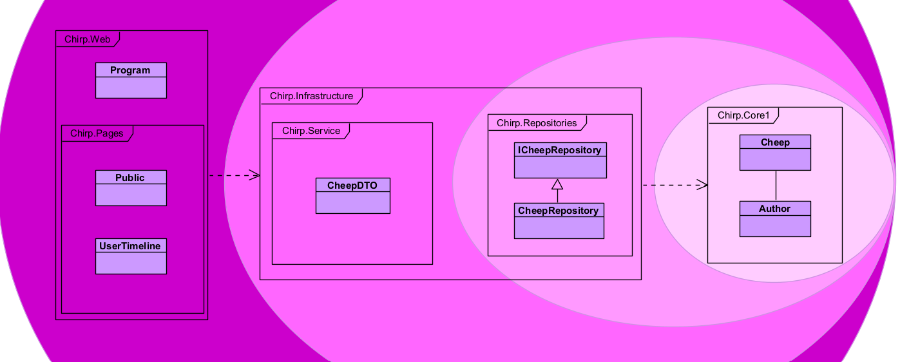
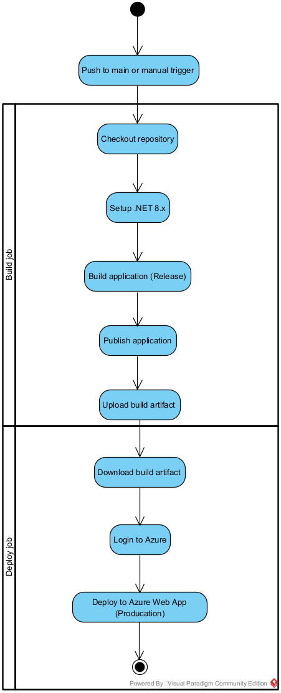
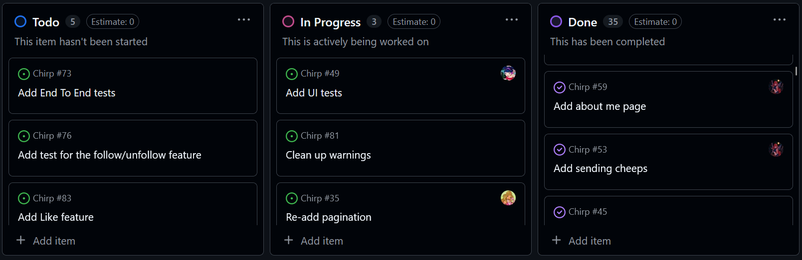

# Design and Architecture

## Domain Model
Provide an illustration of your domain model.  
Make sure it is correct and complete.

## Architecture — In the small
Illustrate the organization of your code base.  
Explain which layers exist in your onion architecture and what belongs to each layer.

## Onion Architecture
This application was build according to the 'Onion Architecture' to increase maintanablity and testability. Below here is an illustration of the architecture.

Domain Entities:
The innermost circle of the model is Chirp.Core1, which is were the fundamental entities of the program lies; Author and Cheep. 

Repository Layer:
The next layer of the model is the Repository Layer, which is a part of Chirp.Infrastructure in the code. This layers contains the repositories and the repository interfaces. Chirp.Infrastructure also contains the ChirpDBContext class.

Service Layer:
Chirp.Infrastructure

UI Layer:
The last layer and the outermost circle of the model is the UI layer and is represented by Chirp.Web in the code. This Layer contains all the razor pages, the database, and Program.cs.

## Architecture of Deployed Application
Illustrate the architecture of your deployed client-server application.  
Show where the server is deployed and how the client communicates with it.

Insert diagram here:

## User Activities
Illustrate typical user journeys:

- First page shown to an unauthorized user  
- What an unauthorized user can do  
- What an authenticated user can do  

Insert activity diagrams or screenshots here:

## Sequence of Functionality / Calls Through Chirp!
Create a UML sequence diagram showing message flow:

- Start with an HTTP request from an unauthorized user  
- End with the fully rendered web page returned  

Include all relevant calls (HTTP, C#, etc.)

Insert diagram here:

# Process

## Build, Test, Release, and Deployment
The activity diagram shows how our GitHub Actions workflow builds and deploys the Chirp! application. The workflow starts when code is pushed to the main branch or when it is started manually. First, the repository is checked out and the .NET environment is set up. Then the application is built and published in release mode, and the resulting files are saved so they can be used later during deployment. After that, the artifact is downloaded, the workflow logs in to Azure, and the application is deployed to the production Azure Web App.

## Team Work
Insert a screenshot of your project board before hand-in:

Briefly describe:

- Which tasks are unresolved

- What features are missing

We do not have any of the wild-style features. We would have liked to implement the "like" button. First we would have added a way to store likes in our database, and then make sure a user only can like a cheep once, by storing which user liked the cheep. The button itself would be added next to each cheep in the webpage, and when a user clicks it, the page sends a POST request to the server. The server sees who is logged-in and which cheep is liked, then saves it in the database. The page should reload then and show the "like" on the cheep.

- Your workflow from issue creation → development → review → merge  

## How to Make Chirp! Work Locally
Describe step-by-step how to clone and run the Chirp! application locally:

- Clone instructions  
- Commands to run  
- Required tools or dependencies  
- Expected output or behavior

If you want to run the Chirp! application locally you will have to follow these steps.
1. Clone the repository to your laptop by using the command **git clone https://github.com/ITU-BDSA2025-GROUP12/Chirp**.
2. To run the program change your directory to "Chirp/Src/Chirp.Web" and write **dotnet run** in the command line.

You should expect a localhost link to open up a webservice, where you can start cheeping!

## How to Run Test Suite Locally
Describe how to run your test suites:

- Required steps  
- How to execute tests  
- What types of tests you have (unit, integration, etc.)  
- What they test

# Ethics

## License
~~State the software license you chose for your application.~~

The software license we chose for our application is the **MIT License**. It is a license that .NET uses, so we chose it as well for our project.

## LLMs, ChatGPT, CoPilot, and Others
Describe:

~~- Which LLM(s) you used (if any)~~
~~- How and when you used them~~  
~~- How helpful they were~~
~~- Whether they sped up or slowed down development~~

In our project we have used **DeepSeek** and **CoPilot**.

DeepSeek has been used in our project for debugging and understanding tasks. It has been a helpful tool to understanding more about the weekly tasks and how to tackle them. While in the case of debugging it has been helpful at times and made no improvement or changes in others. 

In some cases DeepSeek has been used to write code. DeepSeek would be shown the details of our program that it needs as well as the task at hand. Afterwards a prompt would be typed in requesting what specifically is difficult with the implementation. This has actually been less helpful than intended as it has caused us to debug more than write code. Some of the code it has produced has been faulty and the issues have been hard to spot.

It can be hard to understand some of the code DeepSeek produces as it can overcomplicate things or use packages we have not been introduced to. The person who produced this code with a prompt may be able to understand it, but it makes it harder for another member to refactor as the code might not be similar to what was taught in the lecture. The development of our code has been slowed down due to these issues. The book itself has been more helpful to developing working code than DeepSeek has. However DeepSeek has been helpful to bounce ideas off of.

CoPilot has been used for smaller things like assisting some commit messages, which can be quite helpful so that is not the place you get stuck. It has helped speed up the process a little more.
