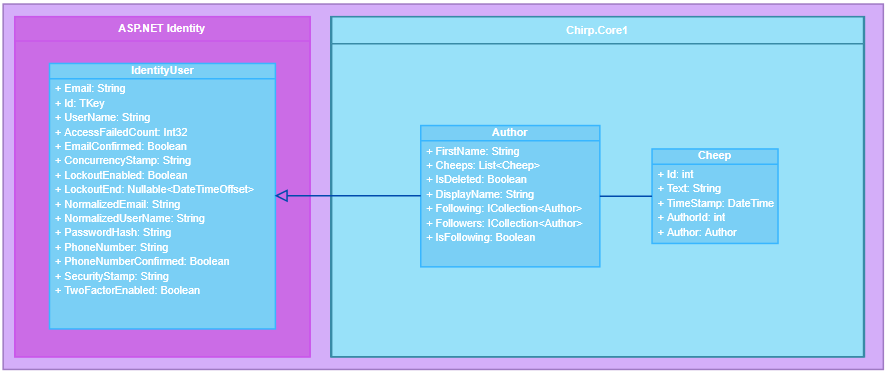
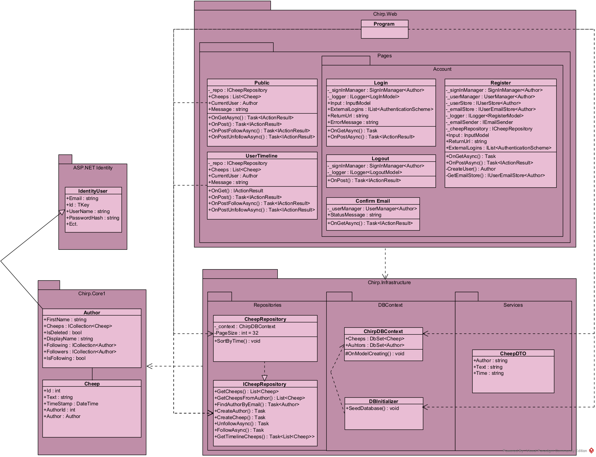
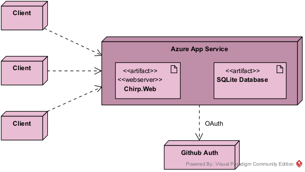
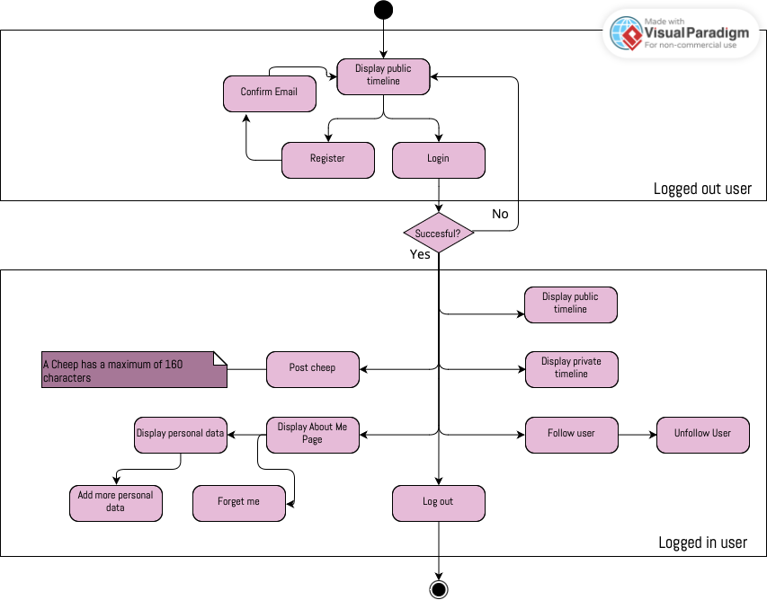
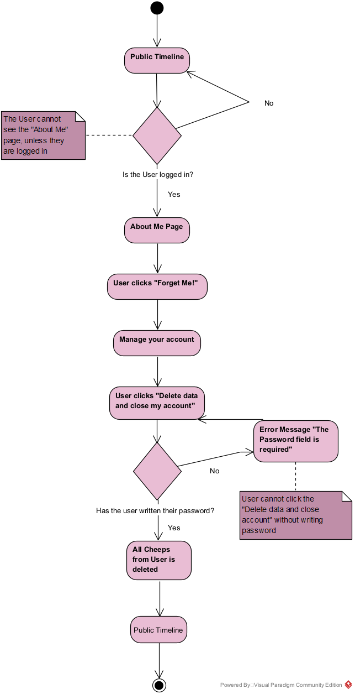
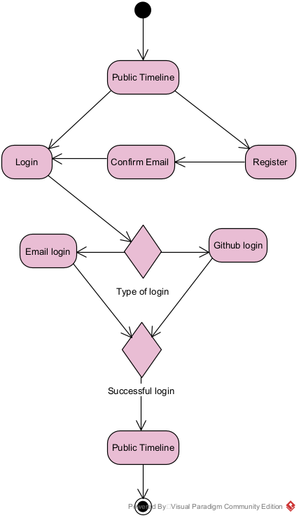
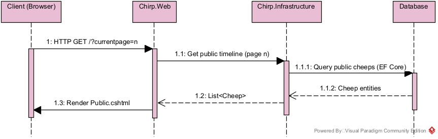

| title    | subtitle              | author 1 | author 2 | author 3 | author 4 | author 5 |
|----------|-----------------------|----------|----------|----------|----------|----------|
| _Chirp!_ | ITU BDSA 2025 Group 12 | Camille Holmskov Larsen <hocl@itu.dk> | Freja Skakke Jørgensen <frsj@itu.dk> | Anna Rasmussen <annar@itu.dk> | Camilla Frøkjær Jørgensen <cfjo@itu.dk> | Ditte Astof Hansen <diah@itu.dk> |

# Design and Architecture

## Domain Model

**Figure 1:** Class diagram. ASP.NET Identity package on the left side. It contains *IdentityUser*. On the right side is our program’s Chirp.Core1 folder. It contains the *Author* class and *Cheep* class.

In **figure 1** it is shown that the Author class inherits from ASP.NET Identity’s class *IdentityUser*. Cheep has an association with the Author class as they both contain instances of each other.

The two classes, Author and Cheep, are fundamental entities in our program as features build upon their attributes.

## Architecture — In the small
This application was build according to the 'Onion Architecture' to increase maintainability and testability. This architecture model helps separate concerns into layers. Each layer has its own responsibility.[^1]
[^1]: https://dev.to/yasmine_ddec94f4d4/onion-architecture-in-domain-driven-design-ddd-35gn

**Figure 2:** Onion Architecture. From left to right: UI layer, Service layer, Repository layer, Domain entities.

Onion Architecture divides our program into multiple layers. The outer layers depend on the layers under it. 

The innermost circle of the model is the **Domain Entities**. It contains the fundamental entities of our program; Author and Cheep. It has no external dependencies.

The next layer of the model is the **Repository Interface**. This layer contains our repository folder. ICheepRepository is an interface that CheepRepository implements. 

Moving one more layer out is the **Service Interface**. This is where our services folder is located. Ideally it would contain a CheepService and/or an AuthorService. Instead our Domain Services layer has taken this responsibility.

The last layer and the outermost circle of the model is the Infrastructure layer and here is the Chirp.Web folder. This layer contains all the razor pages, our database, UI and Program.cs. 

## System Architecture Overview

**Figur 3:** Complete system architecture overview. This UML diagram shows the different classes, folders, pages and interfaces in our system, and how they relate to each other. For clarity, not every single cshtml razor page file has been included.

## Architecture of Deployed Application
Users access the system through a web browser, and all their requests are sent to the Chirp.Web application (which is hosted on Azure App Service).

The SQLite database is hosted together with the web application, and is only accessible through Chirp.Web. It stores application data such as users and cheeps. 

Authentication is handled using GitHub OAuth. When a user logs in, Chirp.Web communicates with GitHub Auth to authenticate the user and receive the necessary identity information.

**Figure 4:** Our Diagram shows how the Chirp! application is deployed in a running system.

## User Activities
The following diagram shows the different user activities that can be made for both authenticated and unauthorized users of the application. As the diagram suggests, a user who is not logged in can only access the Public Timeline page, the Register page and the Login page.
If a user successfully has logged into the application, they now get access to more pages and features such as the Private Timeline page, the About Me page, the follow/unfollow feature and lastly they gain the ability to post cheeps.

**Figure 5:** user activities for both authenticated and unauthorized users.

## Follow-Unfollow 
The following diagram shows the state machine of the follow activity. The user starts at the Public Timeline page and can upon logging in successfully begin following other users.

**Figur 6:** Follow-feature. 

The above flow-chart shows the user journey when following or unfollowing a user. The follow button only appears to logged in users, and will display as "Unfollow" in the event that the user is already following the given author. Users can go to their user-timeline, which only displays cheeps from followed authors and themselves.

## Forget Me Feature
A registered user of the application has the possibility of deleting their account at any moment. To do so the user must go to their About Me page, where the “Forget Me!”- button is located. When clicking the button, the user is redirected to the Manage your account page. At this page the user will need to enter their password and click “Delete data and close my account”. After deleting an account all cheeps from that account are deleted. 

**Figure 7:** Activiy diagram for deleting a user account.

## Login
From the **Public Timeline**, which is the first page shown when opening the website, the user can choose to either register a new account or log in. A user must be registered before they can log in.

When registering an account, the user can choose between **email registration** or **GitHub login**. If the user registers with email, they must confirm their email address as an extra security step.

After a successful login, the user is still able to view the public timeline, but also gains access to their private timeline.

**Figure 8:** Activity diagram showing the flow of registering a user and logging in to the application.

## Sequence of Functionality / Calls Through Chirp!
First, a user’s browser sends an HTTP GET request to Chirp.Web to load the public timeline. Chirp.Web asks Chirp.Infrastructure to get the needed data. Chirp.Infrastructure then fetches the public cheeps from the database using Entity Framework Core. The database sends the cheeps back, and they are passed to Chirp.Web as a list.

Chirp.Web then uses this data to render the Public.cshtml page and sends the finished HTML back to the browser.

The diagram is kept simple and shows only the main parts of the system and how they communicate. It does not show internal method details, but instead focuses on the overall flow of a request through the application.

**Figure 9:** The sequence diagram shows how the Chirp! application loads the public timeline. 

# Process

## Build, Test, Release, and Deployment
The Deployment diagram shows how our GitHub Actions workflow builds and deploys the Chirp! application. 

**Figure 10:** Activity diagram of Github Actions workflow building, testing, releasing and deploying our webservice.

The workflow starts when code is pushed to the main branch or when it is started manually. First, the repository is checked out and the .NET environment is set up. Then the application is built and published in release mode, and the resulting files are saved so they can be used later during deployment. After that, the artifact is downloaded, the workflow logs in to Azure, and the application is deployed to the production Azure Web App.

## Team Work
**Insert a screenshot of your project board before hand-in:**

**Figure 11:** Project-board.

   **Which tasks are unresolved?**
   
Although we are mostly done with the project, there are still a few unresolved tasks and issues on our project board that we would have resolved had we had more time.
As seen on board we are missing multiple test suites for the follow unfollow feature as well as end to end tests of the entire program. Under the in progress tab there are some tasks in progress. Some of the UI tests have been made but we would still have liked to have better test coverage.

There are two more tasks to do that are not shown on the figure. As a user you are able to download data about your account, however it is not completely resolved, as the user will not be able to download a list of their cheeps, who they follow and who follows them. We have created a CheepDTO class but it is not in use. 

   **What features are missing?**
   
Additionally we are missing wild-style features. We would have liked to implement the "like" button. First we would have added a way to store likes in our database, and then make sure a user only can like a cheep once, by storing which user liked the cheep. The button itself would be added next to each cheep in the webpage, and when a user clicks it, the page sends a POST request to the server. The server sees who is logged-in and which cheep is liked, then saves it in the database. The page should reload then and show the "like" on the cheep.

   **Your workflow from issue creation → development → review → merge**
   
The way we would aim to work was by meeting and talking about the requirements of the current week. We would then randomly distribute tasks and each group member would be responsible for creating issues corresponding to their weekly task. 

Some weeks we would meet to code together, depending on what the week required, where one person would host a Code With Me and everyone would join to code. Other weeks we worked separately where each member would do their assigned tasks. Since some weeks required everything to be done in order it would cause members to wait for each other to finish tasks. Later in the development a lot of meetings aimed to be online where members worked separately on features that were missing.

When a new feature was made or a new bug was corrected, a pull request would be made. The team member, who opened it, would write in our group chat “I opened a pull request” and whoever would be available to review the code first would do it. In some instances multiple people have reviewed a code but in most cases only one reviewed before merging the pull request.

At the end of our project work we wanted to clean up our code to make it clean and coherent. During the clean up we wanted to ensure we did not leave unused methods. This means we removed related tests. The group member that created some of our tests is no longer in our group. These tests stopped working due to an issue we could not resolve. Due to the member not being able to explain her tests to us anymore we decided to comment it out.

## How to Make Chirp! Work Locally
  
**If you want to run the Chirp! application locally you will have to follow these steps:**

   1. Clone the repository to your laptop by using the command git clone https://github.com/ITU-BDSA2025-GROUP12/Chirp in your windows or 
   2. You will need .NET version 8 installed on your device to run the program.
   3. To run the program change your directory to "Chirp/Src/Chirp.Web"
   4. Write dotnet run in the command line.
   
You should expect a localhost link in your terminal. Press it to open up a webpage, where you can start making an account and send cheeps.

## How to Run Test Suite Locally
To run the tests of our program follow these steps:
1. Make sure you are at the solution root.
2. Write dotnet test in the command line.
3. Wait for all tests to pass.
4. You should now see tests from Chirp.Core1.Tests, Chirp.Infrastructure.Test, and Chirp.Web.Tests and PlayWrightTests
Our test directory roughly mirrors the src directory. Inside the test directory you find Chirp.Core1.Tests, Chirp.Infrastructure.Tests, Chirp.Web.Test and PlayWrightTest.
For testing we focused on having the recommended distribution of tests. Our test suite therefore mostly consists of unit tests for relevant methods. We do have a few  UI tests where playwright is used to go to our azure web app and assert that everything looks as it's supposed to.
Ideally, as stated in the Teamwork section of the report, more tests need to be added to have better test coverage. This includes End-to-End tests, integration tests and more unit tests for methods that were implemented later.

# Ethics

## License
The software license we chose for our application is the MIT License. It is a license that .NET uses, so we chose it as well for our project.

## LLMs, ChatGPT, CoPilot, and Others

In our project we have used DeepSeek, ChatGPT and CoPilot.
DeepSeek and ChatGPT have been used for the same purposes. They have been used in our project for debugging and understanding tasks. They have been helpful tools to understand more about the weekly tasks and how to tackle them. While in the case of debugging they have been helpful at times and made no improvement or changes in others.

In some cases DeepSeek or ChatGPT has been used to write code. They would be shown the details of our program that they need as well as the task at hand. Afterwards a prompt would be typed in requesting what specifically is difficult with the implementation. This has actually been less helpful than intended as it has caused us to debug more than write code. Some of the code it has produced has been faulty and the issues have been hard to spot.

It can be hard to understand some of the code DeepSeek and ChatGPT produces as they can overcomplicate things or use packages we have not been introduced to. The person who produced this code with a prompt may be able to understand it, but it makes it harder for another member to refactor as the code might not be similar to what was taught in the lecture. The development of our code has been slowed down due to these issues. The book itself has been more helpful to developing working code than DeepSeek and ChatGPT has. However they have been helpful to bounce ideas off of.

CoPilot has been used for smaller things like assisting some commit messages, which can be quite helpful so that is not the place you get stuck. It has helped speed up the process a little more.

